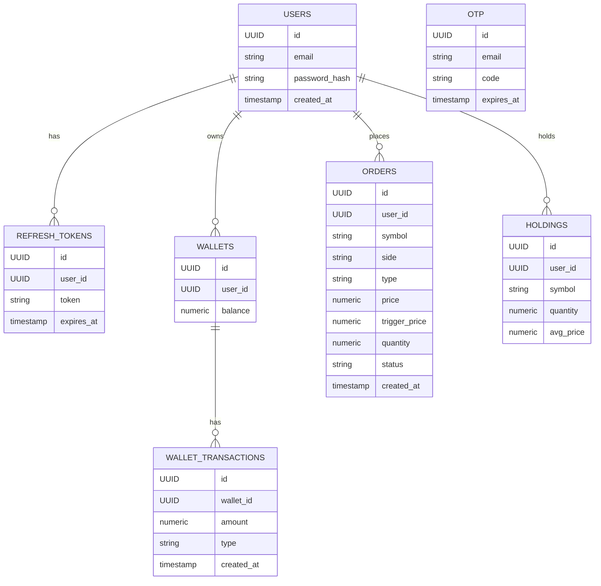

```markdown
# ARCHITECTURE.md  
Finance Manager Backend — Trading Simulation Platform

---

## 1. Introduction

This document describes the **system architecture** of the Finance Manager Backend — a **paper‑trading platform** that uses **real NSE market data (15‑minute delayed)**, **virtual money**, and a **simulated trading engine**.

The goals of this architecture are:

- To simulate a **real brokerage‑style trading backend**
- To handle **real‑time market data** efficiently
- To maintain **clean separation of concerns**
- To be **scalable, maintainable, and extensible**
- To showcase **production‑grade backend engineering skills**

---

## 2. High‑level system architecture

At a high level, the system consists of:

- **REST API** for all trading, wallet, market, and portfolio operations  
- **WebSocket** for real‑time tick streaming  
- **Market data pipeline** (Yahoo → internal state → clients)  
- **Trading engine** (orders → matching → wallet/holdings/portfolio)  
- **PostgreSQL** as the single source of truth for persistence  
- **Rate limiting + JWT security** for safe, production‑style access  

```mermaid
flowchart LR
    Client[Client (Web / Mobile)] -->|HTTP (REST)| API[Spring Boot REST Controllers]
    Client -->|WebSocket| WS[WebSocket Endpoint]

    API --> SVC[Service Layer]
    WS --> RT[Real-Time Tick Stream]

    SVC --> MD[Market Data Services]
    SVC --> ORD[Orders & Trading Engine]
    SVC --> WAL[Wallet Service]
    SVC --> HLD[Holdings Service]
    SVC --> PRT[Portfolio Service]
    SVC --> EXP[Explore Service]

    MD --> YF[YahooFinanceClient]
    YF -->|HTTP| Yahoo[(Yahoo Finance API)]

    SVC --> REPO[JPA Repositories]
    REPO --> DB[(PostgreSQL)]

    subgraph RealTime
        MD --> SNAP[SnapshotService]
        SNAP --> TICK[TickEngine]
        TICK --> RT
        TICK --> EXP
    end
```

---

## 3. Layered architecture

The backend follows a **layered architecture** to keep responsibilities clear and maintainable.

```mermaid
flowchart TB
    PL[Presentation Layer\n(Controllers, WebSocket)] --> SL[Service Layer\n(Business Logic)]
    SL --> DL[Domain Layer\n(Entities, DTOs, Domain Models)]
    DL --> PERS[Data Layer\n(JPA Repositories, PostgreSQL)]
    SL --> INT[Integration Layer\n(YahooFinanceClient, Schedulers, TickEngine, WebSocket Broadcaster, RateLimitFilter)]
```

### 3.1 Presentation layer

- **REST Controllers** expose endpoints for:
  - Auth, OTP, JWT
  - Wallet
  - Orders
  - Holdings
  - Portfolio
  - Market data
  - Explore
- **WebSocket handlers** manage:
  - Client subscriptions to tick streams
  - Broadcasting of real‑time tick updates

### 3.2 Service layer

- Encapsulates **business logic** and workflows:
  - Order validation and placement
  - Matching engine orchestration
  - Wallet debit/credit logic
  - Holdings and portfolio calculations
  - Explore rankings (gainers/losers, sectors, themes)
  - Market data aggregation

### 3.3 Domain layer

- **Entities**: JPA entities mapped to PostgreSQL tables  
- **DTOs**: Request/response models for APIs and WebSocket messages  
- **Domain models**: Internal representations for ticks, snapshots, metrics, etc.

### 3.4 Data layer

- **JPA repositories** for all entities:
  - Users, OTP, refresh tokens
  - Wallet, wallet transactions
  - Orders
  - Holdings
- **PostgreSQL** as the only database engine

### 3.5 Integration layer

- **YahooFinanceClient** for external market data  
- **Schedulers** for:
  - Yahoo polling (mini‑universe)
  - Matching engine  
- **TickEngine** for synthetic ticks  
- **WebSocket broadcaster** for real‑time streaming  
- **RateLimitFilter** (Bucket4j) for global rate limiting  

---

## 4. Market data architecture

Market data is the backbone of the system. It is split into:

- **Real price fetcher** (MarketDataService + YahooFinanceClient)  
- **Explore mini‑universe** (500 stocks, scheduled polling)  
- **TickEngine** (synthetic live movement)  
- **SnapshotService** (single source of truth for OHLC + change%)  
- **WebSocket broadcasting** (real‑time ticks to clients)  

### 4.1 Real price fetcher (MarketDataService + YahooFinanceClient)

The `YahooFinanceClient` is responsible for fetching **real NSE prices** from Yahoo Finance, with **15‑minute delayed data** (as per Yahoo’s behavior). It provides:

- **Current price** (`PriceDto`)
- **Historical candles** (`CandleDto`)
- **Stock metrics** (`StockMetricsDto`)

It uses **in‑memory caches** with TTL to reduce external calls and handle transient failures.

Example (from `YahooFinanceClient`):

```java
public PriceDto getCurrentPrice(String rawSymbol) {
    String symbol = SymbolMapper.toYahooSymbol(rawSymbol);
    validateSymbol(symbol);

    try {
        // CACHE (TTL = 5 seconds)
        CachedPrice cached = priceCache.get(symbol);
        if (cached != null && (System.currentTimeMillis() - cached.timestamp) < 5000) {
            return cached.price;
        }

        // DIRECT FETCH
        PriceDto dto = fetchPrice(symbol);

        // CACHE RESULT
        priceCache.put(symbol, new CachedPrice(dto, System.currentTimeMillis()));

        return dto;

    } catch (Exception ex) {
        log.error("Error fetching price for {}", rawSymbol, ex);

        // FALLBACK
        CachedPrice cached = priceCache.get(symbol);
        if (cached != null) {
            return cached.price;
        }

        return new PriceDto(rawSymbol, 0, 0, 0, 0);
    }
}
```

This service is used by:

- Watchlist  
- Holdings  
- Portfolio  
- Stock detail pages  
- Charts and metrics views  

### 4.2 Explore mini‑universe (500 stocks)

The Explore module maintains a **mini‑universe of 500 NSE stocks**. It is optimized for:

- Top gainers / losers  
- Sector movers  
- Themes (EV, Infra, Make in India, etc.)  
- Trending / most active  

**Key design:**

- 500 symbols loaded from a universe configuration (e.g., `universe.json`)  
- Scheduler runs every **120ms**  
- Each tick:
  - Picks **1 symbol**
  - Fetches its latest price from Yahoo
  - Updates in‑memory state
- Over ~60 seconds, all 500 symbols are refreshed  
- Synthetic ticks are then generated for live movement  

```mermaid
flowchart LR
    subgraph Universe
        U[Universe (500 NSE Symbols)]
    end

    SCHED[@Scheduled(120ms)\nYahoo Polling] -->|1 symbol per cycle| YF[YahooFinanceClient]
    YF --> ST[SymbolStateStore\n(in-memory)]

    ST --> SNAP[SnapshotService]
    SNAP --> EXP[ExploreService]

    EXP --> EXP_API[ExploreController\n(Top Gainers/Losers, Sectors, Themes)]
```

### 4.3 TickEngine (synthetic live movement)

The **TickEngine** runs every second and generates **synthetic ticks** for each symbol in the universe, based on:

- Last anchor price (from Yahoo)  
- Volatility profile  
- Mean reversion  
- Spread simulation  
- Circuit limits  

Pseudo‑code:

```java
@Scheduled(fixedRate = 1000)
public void generateTicks() {
    for (SymbolState state : symbolStateStore.getAll()) {
        double anchor = state.getAnchorPrice(); // from Yahoo
        double last = state.getLastTickPrice();

        double volatility = state.getVolatility(); // per symbol or global
        double randomShock = randomGaussian() * volatility;

        double meanReversion = (anchor - last) * 0.05; // pull back to anchor

        double nextPrice = last + randomShock + meanReversion;
        nextPrice = applyCircuitLimits(nextPrice, anchor);

        state.setLastTickPrice(nextPrice);
        snapshotService.updateFromTick(state.getSymbol(), nextPrice);
    }
}
```

### 4.4 SnapshotService

`SnapshotService` maintains **derived metrics** for each symbol:

- OHLC (open, high, low, close)  
- Change and changePercent  
- Volume (if applicable)  
- Last tick time  

It acts as the **single source of truth** for:

- Explore rankings  
- Watchlist snapshots  
- Portfolio valuations  

### 4.5 WebSocket architecture

The WebSocket layer streams **real‑time ticks** to subscribed clients.

```mermaid
flowchart LR
    TICK[TickEngine] --> SNAP[SnapshotService]
    SNAP --> BROAD[TickBroadcaster]

    subgraph WebSocket Layer
        SUB[Subscription Manager] --> SESS[Active Sessions]
        BROAD --> SESS
    end

    Client1[Client A] -->|Subscribe symbol(s)| SUB
    Client2[Client B] -->|Subscribe symbol(s)| SUB
```

- Clients subscribe to specific symbols or groups  
- Subscription manager tracks per‑session subscriptions  
- Broadcaster pushes tick messages only to interested sessions  
- Avoids duplicate sessions and memory leaks  

---

## 5. Trading engine architecture

The trading engine simulates a **real brokerage order lifecycle** with:

- Market, Limit, SL, SL‑M orders  
- Pending queue  
- Matching engine (scheduled)  
- Wallet integration  
- Holdings integration  
- Portfolio impact  

### 5.1 Order placement flow

```mermaid
flowchart LR
    Client --> ORD_API[OrdersController]
    ORD_API --> ORD_SVC[OrdersService]
    ORD_SVC --> VAL[Validation]
    VAL --> SAVE[Save Order (status=PENDING)]
    SAVE --> QUEUE[Pending Orders Queue]
    QUEUE --> MATCH[Matching Engine (@Scheduled)]
```

Typical flow in `OrdersService`:

```java
public OrderDto placeOrder(PlaceOrderRequest req, User user) {
    validateOrder(req, user);

    Order order = orderMapper.toEntity(req, user);
    order.setStatus(OrderStatus.PENDING);
    orderRepository.save(order);

    pendingOrderQueue.add(order.getId());
    return orderMapper.toDto(order);
}
```

### 5.2 Matching engine

The **Matching Engine** runs every second and processes pending orders:

- Reads pending orders  
- Fetches current tickPrice for the symbol  
- Applies execution rules based on order type:

  - **Market**: execute at current tickPrice  
  - **Limit**: execute if price crosses limit condition  
  - **SL / SL‑M**: execute when trigger price is hit  

```mermaid
flowchart TB
    MATCH_SCHED[@Scheduled(1s)\nmatchOrders()] --> LOAD[Load Pending Orders]
    LOAD --> LOOP[For each Order]
    LOOP --> PRICE[Get tickPrice from SnapshotService]
    PRICE --> DECIDE{Execution Condition Met?}
    DECIDE -->|No| SKIP[Keep Pending]
    DECIDE -->|Yes| EXEC[Execute Order]
    EXEC --> WAL[Update Wallet]
    EXEC --> HLD[Update Holdings]
    EXEC --> STATUS[Update Order Status\n(FILLED / PARTIALLY_FILLED)]
```

Pseudo‑code:

```java
@Scheduled(fixedRate = 1000)
public void matchOrders() {
    List<Order> pending = orderRepository.findAllPending();

    for (Order order : pending) {
        double ltp = snapshotService.getLastPrice(order.getSymbol());

        if (!shouldExecute(order, ltp)) {
            continue;
        }

        executeOrder(order, ltp);
    }
}
```

### 5.3 Wallet integration

- **BUY**:
  - Debit wallet balance by `executedQty * executedPrice`
  - Create wallet transaction entry  
- **SELL**:
  - Credit wallet balance  
  - Create wallet transaction entry  

Wallet is modeled as:

- **Wallet**: current balance (derived from transactions)  
- **WalletTransaction**: immutable ledger of all debits/credits  

### 5.4 Holdings integration

On execution:

- For **BUY**:
  - If holding exists:
    - Update quantity  
    - Recalculate weighted average price  
  - Else:
    - Create new holding  
- For **SELL**:
  - Reduce quantity  
  - If quantity becomes zero → delete holding  

Holdings store:

- Symbol  
- Quantity  
- Average buy price  

### 5.5 Portfolio calculation

Portfolio is computed **on the fly** using:

- Holdings (quantity, avgPrice)  
- Current tickPrice (from SnapshotService or MarketDataService)  
- Previous close (for today’s P&L)

For each holding:

- **Current value** = `qty * tickPrice`  
- **Cost** = `qty * avgPrice`  
- **Unrealized P&L** = `currentValue - cost`  
- **Today’s P&L** = `qty * (tickPrice - previousClose)`  

Portfolio aggregates:

- Total portfolio value  
- Total unrealized P&L  
- Total today’s P&L  
- Per‑stock breakdown  

---

## 6. Security & rate limiting architecture

Security is handled via:

- **JWT authentication**  
- **Spring Security filters**  
- **Global rate limiting** using Bucket4j  

```mermaid
flowchart LR
    REQ[Incoming HTTP Request] --> RL[RateLimitFilter (Bucket4j)]
    RL -->|Allowed| JWT[JwtFilter]
    RL -->|Rejected| RL_ERR[429 Too Many Requests]

    JWT --> SEC[Spring Security Context]
    SEC --> CTRL[Controller]
```

### 6.1 JWT authentication

- Access tokens are validated on each request  
- User identity is loaded into the security context  
- Protected routes:
  - `/wallet/**`
  - `/orders/**`
  - `/holdings/**`
  - `/portfolio/**`
  - `/market/**`
  - `/explore/**` (if required)

### 6.2 Rate limiting (Bucket4j)

- **Global IP‑based rate limiting**  
- Example: 20 requests/min (configurable)  
- Applied **before** JWT filter to protect:
  - OTP endpoints  
  - Auth endpoints  
  - Market data endpoints  
  - Orders and trading endpoints  

---

## 7. Database architecture (PostgreSQL)

PostgreSQL is the **only database** used in the system.



Key points:

- **Users** own a **Wallet** and multiple **Holdings**  
- **WalletTransactions** form an immutable ledger  
- **Orders** track the full lifecycle of trades  
- **Refresh tokens** support secure session management  

---

## 8. Scalability & future enhancements

The current architecture is a **modular monolith** that can evolve into more distributed patterns.

### 8.1 Horizontal scaling

- Stateless services (except DB)  
- Can be scaled behind a load balancer  
- WebSocket scaling can be handled via:
  - Sticky sessions  
  - External pub/sub (e.g., Redis, Kafka)  

### 8.2 Caching

- Introduce Redis for:
  - Market snapshots  
  - Explore rankings  
  - User session data  

### 8.3 Event‑driven architecture

- Use Kafka or similar for:
  - Order events  
  - Wallet events  
  - Market data events  

### 8.4 Microservices split

Potential future split:

- **Auth Service**  
- **Market Data Service**  
- **Trading Service** (orders + matching)  
- **Wallet Service**  
- **Portfolio Service**  

---

## 9. Conclusion

This architecture combines:

- **Real NSE market data (15‑minute delayed)**  
- **Virtual money and simulated execution**  
- **Clean layered design**  
- **Real‑time tick streaming**  
- **A realistic trading engine**  
- **PostgreSQL‑backed persistence**  
- **JWT security and rate limiting**  

It is designed to be:

- **Understandable** for new developers  
- **Impressive** for hiring managers and senior engineers  
- **Extensible** for future features  
- **Robust** enough to resemble a real fintech backend.

This document, together with `README.md` and API documentation, presents the Finance Manager Backend as a **serious, production‑style trading simulation platform** built with **professional backend engineering practices**.
```